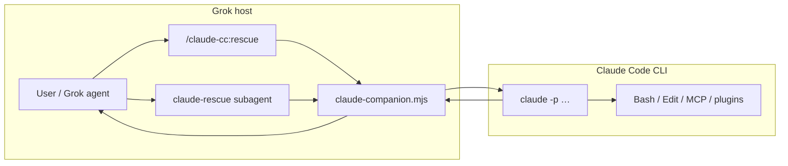

# Claude-CC Plugin for Grok — Design & Implementation Plan

**Status:** proposed  
**Date:** 2026-07-01  
**Author:** yanggf + Grok session  
**Goal:** A Grok-native plugin that delegates coding, debugging, and review tasks to the **Claude Code CLI** — the reverse direction of `grok-plugin-claude-code` / `codex-plugin-cc`.

---

## 1. Problem

Today the ecosystem has one-way delegation plugins:

| Plugin | Host | Worker |
|--------|------|--------|
| `codex@openai-codex` | Claude Code | Codex CLI |
| `grok-cc@grok-plugin-claude-code` | Claude Code | Grok CLI |

There is **no published Grok plugin** that spawns Claude Code as a parallel worker. Grok users who want Claude's toolchain (Claude plugins, MCP servers, `CLAUDE.md` context, Opus/Sonnet routing) must manually run:

```bash
claude -p "…" --output-format json
```

This plan defines a thin, codex-shaped plugin for Grok: **`claude-cc@claude-plugin-grok`**.

---

## 2. Design principles

Mirror `grok-plugin-claude-code` deliberately:

1. **Thin forwarder, not orchestrator.** Grok (or a `claude-rescue` subagent) invokes one companion script and returns stdout verbatim.
2. **Headless CLI wrapper.** No long-running broker in v1; `claude -p` is one-shot. **v1 background = a plain detached `claude -p` process writing to a logfile** — it deliberately does **not** use `claude --bg` / `claude agents` (a separate session-manager model; see §5.3 and §11 Q2).
3. **Plain-text user output.** Companion renders human-readable summaries; JSON is internal only.
4. **Fail loud on readiness.** Missing binary or auth → exit 1 with actionable message; no silent fallback.
5. **Lean v1.** Ship `setup`, `task`, `review` first; defer job registry / adversarial gate / session-transfer parity.

Non-goals for v1:

- Bidirectional session handoff (Codex plugin's `/codex:transfer` from Claude → Codex is out of scope).
- Installing Claude Code from the plugin (setup probes only; install hint only).
- Replacing Grok's own subagents for simple tasks.

---

## 3. Proposed surface area

### Plugin identity

| Field | Value |
|-------|-------|
| Marketplace repo | `yanggf/claude-plugin-grok` (or org repo TBD) |
| Plugin name | `claude-cc` |
| Slash prefix | `/claude-cc:` |
| Subagent | `claude-rescue` |
| Companion | `scripts/claude-companion.mjs` |

### Commands (v1)

| Command | Purpose |
|---------|---------|
| `/claude-cc:setup` | Probe `claude` binary, version, auth; optional `--json` |
| `/claude-cc:rescue <task>` | Delegate a write-capable (default) or read-only task |
| `/claude-cc:review [focus]` | Read-only review of working tree or branch diff |

### Routing flags (stripped before task text)

| Flag | Maps to Claude CLI |
|------|-------------------|
| _(default)_ | write-capable run |
| `--read` | `--permission-mode plan` |
| `--background` | detached spawn + log path (see §5.3) |
| `--effort <level>` | `--effort <level>` |
| `--model <id>` | `--model <id>` |
| `--cwd <path>` | run subprocess with `cwd` |
| `--resume [session]` | `-r [value]` / `--resume` (fall back to `-c` only when no id is given) |
| `--worktree [name]` | `-w` / `--worktree [name]` |
| `--add-dir <path>` | `--add-dir <path>` (repeatable) |

> Concurrent same-cwd delegations must not rely on `-c` ("most recent conversation in the current directory") — that is race-prone when two rescues run in one repo. Pass the `session_id` reported in §5.4 to `-r <id>`; use `-c` only when no id is supplied.

Review-only flags:

| Flag | Effect |
|------|--------|
| `--scope auto\|working-tree\|branch` | diff collection scope |
| `--base <ref>` | branch compare base (default `main`) |
| `--adversarial` | stricter review prompt |
| `--background` | detached review run |

Deferred to v2: `/claude-cc:status`, `/claude-cc:result`, `/claude-cc:cancel`, stop-review gate hook, adversarial-review as separate command.

---

## 4. Architecture



### Component inventory

```
claude-plugin-grok/
├── .grok-plugin/
│   └── marketplace.json          # Grok marketplace manifest
├── plugins/claude-cc/
│   ├── .grok-plugin/plugin.json  # Plugin manifest (Grok format)
│   ├── agents/claude-rescue.md     # Thin forwarder subagent
│   ├── commands/
│   │   ├── setup.md
│   │   ├── rescue.md
│   │   └── review.md
│   ├── skills/
│   │   ├── claude-cli-runtime/SKILL.md
│   │   └── claude-result-handling/SKILL.md
│   └── scripts/
│       └── claude-companion.mjs    # setup | task | review
├── tests/
│   ├── companion.test.mjs
│   └── fake-claude-fixture.mjs
├── README.md
└── LICENSE
```

**Compatibility note:** Grok also reads `.claude-plugin/` paths and sets `CLAUDE_PLUGIN_ROOT` aliases on hooks. The plugin should ship **`.grok-plugin/plugin.json`** as canonical; optionally duplicate under `.claude-plugin/` only if dual-host install is a later requirement.

> ⚠️ **Env-contract caveat:** the commands and the `claude-rescue` subagent (§6) invoke the companion via `${GROK_PLUGIN_ROOT}`. Grok's docs only clearly guarantee plugin-root env vars for **hooks** — not for command/agent invocation. **PR 1 must verify `GROK_PLUGIN_ROOT` actually resolves in command/agent context** (fall back to a script-relative path if not).

---

## 5. Companion runtime (`claude-companion.mjs`)

### 5.1 Binary resolution

```javascript
// Priority order
process.env.CLAUDE_BIN
→ `which claude`
→ ~/.local/bin/claude
→ ~/.nvm/.../bin/claude   // don't hardcode; which is enough
```

### 5.2 Auth probe (`setup`)

Check readiness without spawning a full agent turn:

1. Binary exists and `claude --version` succeeds.
2. **Primary auth check:** `claude -p "ping" --output-format json` with a 30s timeout — treat exit code `0` and `is_error: false` as authenticated. This exercises the real auth path without depending on an internal file format.
3. **Fast-path fallback only:** if the smoke is skipped for speed, sniff `ANTHROPIC_API_KEY` in env, else `~/.claude/.credentials.json` for a non-empty `claudeAiOauth.accessToken`. ⚠️ The credentials file is an **undocumented internal schema that may drift** — never treat it as the primary readiness contract, and never echo its contents.

Setup output (plain text):

```
claude binary:   /home/…/bin/claude
claude version:  2.x.y (from --version)
authenticated:   yes
auth source:     oauth | api_key
ready:           yes — /claude-cc:rescue and claude-rescue subagent available
```

JSON mode (`setup --json`) for scripting:

```json
{
  "ok": true,
  "binary": "/home/yanggf/.nvm/versions/node/v24.3.0/bin/claude",
  "version": "2.x.y",
  "authenticated": true,
  "authSource": "oauth",
  "detail": "ready"
}
```

If not authenticated, instruct: run `claude` interactively once or export `ANTHROPIC_API_KEY` (never echo secrets).

### 5.3 Task execution (`task`)

Build Claude argv from parsed routing flags:

```javascript
const args = [
  "-p", prompt,
  "--output-format", "json",
];
if (opts.read) {
  args.push("--permission-mode", "plan");
} else {
  // Non-interactive write delegation from Grok host
  args.push("--permission-mode", "dontAsk");
}
if (opts.effort) args.push("--effort", opts.effort);
if (opts.model) args.push("--model", opts.model);
if (opts.resume) args.push("-r", opts.resume);   // resume a specific session by id
else if (opts.continueLast) args.push("-c");      // -c = most-recent-in-cwd; fallback only
if (opts.worktree !== undefined) {
  opts.worktree
    ? args.push("--worktree", opts.worktree)
    : args.push("--worktree");
}
for (const d of opts.addDirs) args.push("--add-dir", d);
```

**Foreground:** spawn `claude`, capture stdout, parse JSON, render summary.

**Background (v1 decision):** mirror `grok-companion.mjs` with a **plain detached `claude -p` process + logfile** — do **not** use `claude --bg` / `claude agents` in v1. `--bg` is a separate session-manager model (jobs managed via `claude agents`) whose log/session-discovery API is still an open question (§11 Q2); adopting it is deferred to v2. The v1 mechanism:

- Log dir: `$TMPDIR/claude-delegate/claude-<pid>.log`
- Detached child running `claude -p …` (no `--bg`); print `pid`, `cwd`, `log` path
- User tails log; final JSON line contains `result` + `session_id`

### 5.4 JSON parsing differences (critical)

Verified on this host (2026-07-01):

| Field | Grok `-p --output-format json` | Claude `-p --output-format json` |
|-------|-------------------------------|----------------------------------|
| Text body | `text` | `result` |
| Session | `sessionId` | `session_id` |
| Stop reason | `stopReason` | `stop_reason` |

The companion must normalize Claude's envelope in `parseResult()` and render:

```
=== claude delegate result ===
mode:    write-capable | read-only (plan)
model:   claude-opus-4-8
stop:    end_turn
session: b72d1bda-3471-48f9-b483-4dc618b8e5ad

<result text>

Continue this thread: claude -r <session_id>   (in <cwd>)
```

### 5.5 Review (`review`)

Copy the diff-gathering approach from `grok-companion.mjs` `gatherDiff()`:

- Embed diff in prompt (do not ask Claude to run `git` in plan mode).
- Always `--permission-mode plan`.
- Support `--scope branch --base main` and working-tree scope.
- Truncate at 100k chars with explicit partial-coverage note.

Review prompt template: same severity-ordered findings structure as grok-cc review.

---

## 6. Agent & command contracts

### `agents/claude-rescue.md`

Identical forwarding discipline to `grok-rescue.md`:

- One `Bash` call: `node "${GROK_PLUGIN_ROOT}/scripts/claude-companion.mjs" task …`
- Default write-capable; `--read` when user wants diagnosis only.
- Foreground for bounded tasks; `--background` for open-ended work.
- Return stdout verbatim; no Grok-side repo inspection.

### `commands/rescue.md`

Same shape as `grok-cc/commands/rescue.md` but references `GROK_PLUGIN_ROOT` and `/claude-cc:setup`.

### `skills/claude-cli-runtime/SKILL.md`

Internal contract for subagent/command authors:

- Allowed subcommands: `setup`, `task`, `review` only.
- Never call `status`/`cancel` in v1.
- Document flag stripping rules and Claude-specific permission modes.

---

## 7. Installation & distribution

### From Grok (target UX)

```bash
grok plugin marketplace add yanggf/claude-plugin-grok
grok plugin install claude-cc@claude-plugin-grok --trust
```

Then in session:

```
/claude-cc:setup
/claude-cc:rescue fix the failing auth test in apps/api
/claude-cc:review --scope branch --base main security regressions
```

### Local dev install

```bash
grok plugin install ./claude-plugin-grok/plugins/claude-cc --trust
grok plugin validate ./claude-plugin-grok/plugins/claude-cc
```

### Prerequisites (documented in README)

- Claude Code CLI on `PATH` (`npm install -g @anthropic-ai/claude-code` or official installer).
- Anthropic auth: OAuth via interactive `claude` **or** `ANTHROPIC_API_KEY`.
- Node.js ≥ 20 (companion script only).

---

## 8. Security, cost, and safety

| Risk | Mitigation |
|------|------------|
| Prompt + repo code sent to Anthropic | Document clearly in README (same caveat as codex/grok-cc plugins). |
| Write-capable delegation mutates repo | Default `--permission-mode dontAsk` only when user did not pass `--read`; Grok host should prefer `--read` for review-only asks. **See the write-mode policy note below — `dontAsk` must be proven to actually permit headless writes.** |
| Runaway cost | Render `total_cost_usd` from JSON. **`setup` also warns that each delegation is a full model turn** — a one-word smoke measured ~$0.22 on Opus with a cold cache; the figure varies with the user's model default and cache state. |
| Secret leakage in logs | Never print tokens; redact env in debug. |
| Plugin trust | Requires `grok plugin install --trust`; hooks none in v1. |

**Permission mode mapping (v1 decision):**

| Mode | Claude flag | When |
|------|-------------|------|
| Read-only | `--permission-mode plan` | `--read`, all reviews |
| Write | `--permission-mode dontAsk` | default rescue |
| (v2) YOLO | `--dangerously-skip-permissions` | only with explicit `--yolo` flag + README warning |

> **Write-mode policy (must resolve in PR 1):** choosing `dontAsk` is necessary but **not sufficient** — under headless `-p` there is no TTY to prompt, so if a tool is not pre-allowed the delegation can silently **deny-by-default** and the write no-ops. PR 1 must (a) document the required allow-rules / tool settings (e.g. `--allowedTools` or settings) so a default rescue is genuinely write-capable, and (b) **prove** an actual file write lands headless (see PR 1 acceptance), not assume it.

---

## 9. Testing strategy

### Unit tests (`node --test`)

- `parseTaskArgs` / `parseReviewArgs` flag stripping
- `buildTaskArgs` → expected Claude argv
- `parseResult` handles Claude JSON (`result`, `session_id`)
- `gatherDiff` with fixture git repo
- `resolveClaudeBin` fallback order (mock `which`)

### Integration tests (optional CI job, `CLAUDE_INTEGRATION=1`)

- Skip if no `claude` or no auth (same pattern as travel-cli Turso tests).
- `setup --json` → `ok: true` on dev machine.
- `task --read "what is 2+2"` foreground smoke.
- Assert rendered output contains `=== claude delegate result ===`.

### Manual verification checklist

- [ ] `/claude-cc:setup` in Grok TUI
- [ ] `/claude-cc:rescue` foreground write edits a file
- [ ] `/claude-cc:rescue --read` does not edit
- [ ] `/claude-cc:rescue --background` returns log path; tail shows result
- [ ] `/claude-cc:rescue --resume <session>` continues that specific session (`-r <id>`, not `-c`)
- [ ] `/claude-cc:review` on dirty working tree
- [ ] `claude-rescue` subagent forwards without Grok commentary
- [ ] `grok plugin validate` passes

---

## 10. Implementation phases (PR plan)

### PR 1 — Scaffold + companion core (~300 LOC)

- Repo scaffold + marketplace manifest
- `claude-companion.mjs`: `setup`, `task` (foreground only)
- `commands/setup.md`, `commands/rescue.md`
- `skills/claude-cli-runtime/SKILL.md`
- README with install + auth
- Unit tests for arg parsing + JSON render

**Acceptance:**
- `node claude-companion.mjs setup` reports ready and `task "say ok"` returns a rendered result on dev host.
- **Headless write proven:** a `task` (default `dontAsk`, no `--read`) that edits a file actually changes the file on disk — confirms `dontAsk` permits writes headless (finding: `dontAsk` may deny-by-default).
- **`GROK_PLUGIN_ROOT` resolves in command/agent context** (not just hooks), or the script-relative fallback is in place.

### PR 2 — Review + background + subagent

- `review` subcommand + `commands/review.md`
- Background detach + log rendering
- `agents/claude-rescue.md`
- `skills/claude-result-handling/SKILL.md`

**Acceptance:** `/claude-cc:review` verified manually. (`--background` is **not** a PR 2 acceptance gate — the v1 detached-`claude -p`+logfile mechanism is validated only *if implemented*; the broader `--bg`/`claude agents` model stays deferred per §11 Q2.)

### PR 3 — Flags parity + hardening

- `--worktree`, `--add-dir`, `--effort`, `--model`
- Better auth edge cases (expired OAuth → re-login hint)
- Integration test gate + `grok plugin validate` in CI
- CHANGELOG + v0.1.0 tag

**Acceptance:** Flag matrix documented; CI green.

### PR 4 (optional v2) — Job tracking

Only if Claude CLI exposes stable background job IDs:

- `status` / `result` / `cancel` subcommands
- Align with `claude agents` if `--bg` session management matures

---

## 11. Open questions

1. **Repo location:** standalone `yanggf/claude-plugin-grok` vs monorepo under an existing org?
2. **Background model:** ~~open~~ **decided for v1** — use a plain detached `claude -p` + logfile (§5.3); `claude --bg` / `claude agents` is **not** used in v1. Still open **for v2 only**: confirm the `--bg` log/session-discovery API before building the job registry (PR 4).
3. **Plugin prefix:** `claude-cc` (matches `grok-cc`) vs `claude` (shorter; risk of name collision).
4. **Dual-host:** worth shipping `.claude-plugin/` duplicate so Claude Code can also install it for symmetry? Probably not — wrong direction.
5. **Model default:** leave unset (user's Claude settings) vs pin `claude-opus-4-8` in companion?

**Recommendation:** unset model default; document `--model` override.

---

## 12. Reference files (read before coding)

| Reference | Path on this host |
|-----------|-------------------|
| Grok → Claude Code plugin (inverse of ours) | `~/.claude/plugins/marketplaces/grok-plugin-claude-code/` |
| Companion to port from | `plugins/grok-cc/scripts/grok-companion.mjs` |
| Codex plugin (heavier job model) | `~/.claude/plugins/marketplaces/openai-codex/plugins/codex/` |
| Grok plugin docs | `~/.grok/docs/user-guide/09-plugins.md` |
| Claude headless | `~/.grok/docs/user-guide/14-headless-mode.md` (Grok); `claude --help` (Claude) |

---

## 13. Success criteria

The plugin is **done for v1** when:

1. A Grok user can `grok plugin install claude-cc@claude-plugin-grok --trust` and `/claude-cc:setup` reports ready.
2. `/claude-cc:rescue <task>` delegates to Claude Code and returns rendered stdout without Grok adding its own analysis.
3. Read-only and write modes behave differently (`plan` vs `dontAsk`).
4. Review works without Claude needing shell access to gather the diff.
5. README documents auth, cost, and one-way Grok→Claude delegation clearly.

---

## 14. Next action

Implement **PR 1** in a new repo `claude-plugin-grok`, validate on this WSL host where `claude` is already installed and OAuth-authenticated, then dogfood from the `travel-2026` workspace before publishing the marketplace.